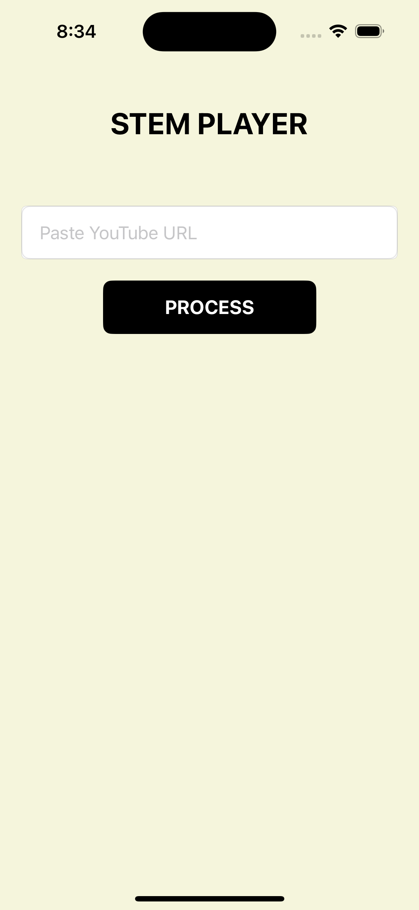
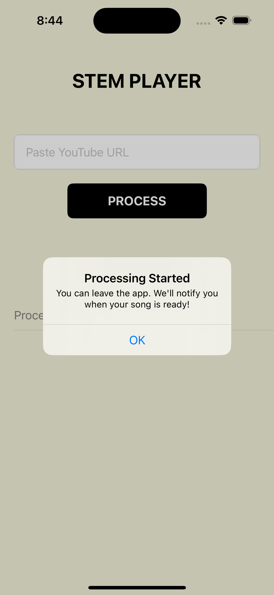
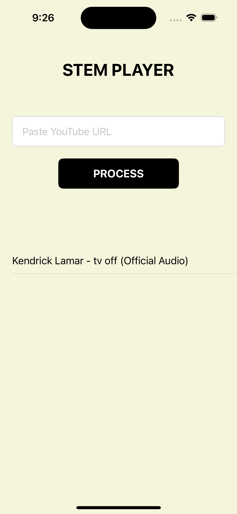
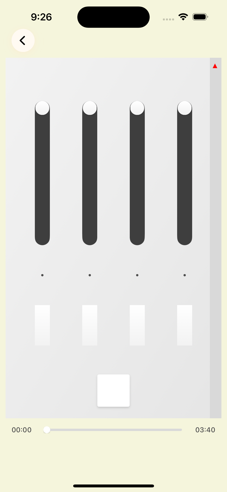

# iOS Stem Player
A full-stack application that splits music tracks into individual stems (vocals, drums, bass, other) and provides an intuitive interface for real-time mixing and playback control. Currently for development and educational purposes only - not available on the App Store. Requires local setup of Python backend and iOS development environment to run.

This code is provided as-is for local development and educational purposes only. 
I am not responsible for any misuse of the code or violations of third-party terms.
Users are responsible for ensuring compliance with relevant laws and policies.

## Demo
[Download the demo video](demoVideo.mov)
<p align="center">
  
  
  
  
  
</p>


## Features
- YouTube URL processing to extract audio
- Automatic stem separation using Demucs
- Real-time mixing interface with individual stem control
- Background processing with status updates and notifications
- Persistent storage of processed songs
- Synchronized playback of multiple audio streams
- High-quality MP3 compression for efficient storage
- Intuitive touch-based slider controls for stem mixing
- Visual feedback with LED indicators for muted tracks

## Technical Stack
### Backend (Python/Flask)
- Flask server with CORS support
- yt-dlp for YouTube audio extraction
- Demucs for stem separation
- Background task processing
- RESTful API endpoints
- File management system
- Status tracking and cleanup routines

### iOS Frontend (Swift/UIKit)
- Custom UI components with animations
- AVFoundation for audio playback
- Background processing management
- Persistent storage handling
- Touch gesture recognition
- Real-time audio mixing
- State management and synchronization

## Requirements
### Backend
- Python 3.8+
- Required Python packages:
  - flask
  - flask-cors
  - yt-dlp
  - demucs
  - pydub
- FFmpeg (for audio processing)

### Frontend
- Xcode 14+
- iOS 15.0+
- macOS for development

## Getting Started
1. Set up the Python backend:
   ```bash
   pip install -r requirements.txt
   ```

2. Install FFmpeg (if not already installed):
   - macOS: `brew install ffmpeg`
   - Linux: `apt-get install ffmpeg`
   - Windows: Download from FFmpeg website

3. Run the Flask server:
   ```bash
   python server.py
   ```

4. iOS Setup:
   - Open Xcode and create a new project
   - Copy the Swift files into your project
   - Find your computer's IP address:
     - macOS: System Preferences → Network
     - Usually looks like: 192.168.1.xxx
   - Update `baseURL` in `MenuViewController.swift`:
     ```swift
     private let baseURL = "http://YOUR_IP_HERE:5001"
     ```
   - Build and run the iOS application

## Usage
1. Launch the app
2. Paste a YouTube URL
3. Wait for processing (you'll receive a notification when complete)
4. Tap the processed song to download stems
5. Use the mixer interface to control individual stems

## License
This project is licensed under the MIT License - see the [LICENSE](LICENSE) file for details.

## Disclaimers
This code is provided as-is for local development and educational purposes only. 
I am not responsible for any misuse of the code or violations of third-party terms.
Users are responsible for ensuring compliance with relevant laws and policies.

### YOUTUBE TERMS OF SERVICE NOTICE:
YouTube's Terms of Service prohibit downloading or copying videos without explicit permission from the content owner. This tool should only be used with:

- Content you own
- Content you have explicit permission to download
- Content that is in the public domain
- Content under licenses that permit downloading

Users are responsible for ensuring they have the right to download any content. I am not responsible for any violations of YouTube's Terms of Service or any copyright infringement.
